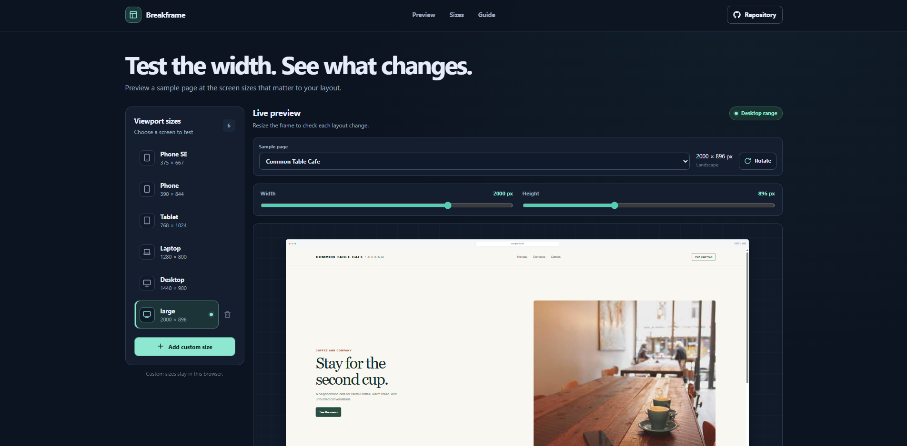

# Breakframe

Breakframe is a responsive layout preview tool. Choose a common viewport or set an exact width and height, then inspect how an included sample page responds at that size.

**Live site:** [https://a2rp.github.io/responsive-breakpoint-preview/](https://a2rp.github.io/responsive-breakpoint-preview/)

## Preview a layout

The fixed header links to the live preview, saved viewport sizes, and breakpoint guide. Its Repository link opens this project's GitHub repository in a new tab and stays available on mobile.

The preview workspace includes two sample pages: Open Tide Retreat and Common Table Cafe. Choose a page from the Sample page selector. Each sample is displayed in an isolated frame and uses local images, so it does not request remote page content.

Choose Phone SE, Phone, Tablet, Laptop, or Desktop to load a useful starting size. Adjust the width from 320 to 2560 pixels and the height from 320 to 1920 pixels with the sliders. Rotate swaps the current dimensions. The frame scales to fit the available panel, while the embedded page keeps the selected pixel width and height so its CSS media queries respond to the test size.

## Check breakpoints

The preview reports the current size range. In Check a breakpoint, use either button to test one pixel before a checkpoint or exactly at 480, 768, 1024, or 1280 pixels. The app updates the live preview and scrolls back to it.

## Save custom sizes

Select Add custom size to enter a name, width, and height. A custom size can be selected from the viewport list or removed after confirming the action. Cancel, Escape, closing the dialog, or clicking the backdrop leaves it saved. The confirmation dialog opens on its safe Keep size action and keeps keyboard focus within the dialog.

You can keep up to eight custom sizes. They are saved in this browser's local storage under `breakframe-custom-viewports`. The built-in sizes remain available if local storage is disabled. Custom sizes are not synced between browsers or devices.

## Included interface

- A fixed, responsive header with smooth links to the preview, size controls, and guide.
- A viewport library with five built-in screen sizes and up to eight saved custom sizes.
- Width and height controls, an orientation swap, and a fitted device frame.
- Two responsive sample pages with local image files and layout changes at 480, 768, and 1024 pixels.
- A breakpoint guide with controls for the pixel before and at each checkpoint.
- An accessible custom-size removal dialog and a Back to top button after the page scrolls more than 50 pixels.
- A two-sided footer with the project source, profile, and support links.

## Data and limits

Only custom viewport definitions persist in local storage. The currently selected sample page and viewport are not saved. The preview contains the two sample pages bundled with the app; it does not load arbitrary websites, extensions, or local files. The app does not capture or export screenshots.

Images are stored in `public/images` and load from the deployed project. The shared `public/preview.png` is used for social sharing metadata. The root `screenshot.png` is the README screenshot and can be added separately.

## Run locally

```sh
npm install
npm run dev
```

## Check and deploy

```sh
npm run lint
npm run build
npm run deploy
```

The deploy command builds the project and publishes `dist` to the `gh-pages` branch. It does not use a GitHub Actions workflow.

**Deployed URL:** [https://a2rp.github.io/responsive-breakpoint-preview/](https://a2rp.github.io/responsive-breakpoint-preview/)

## Future improvements

The following are ideas only and are not implemented:

- Compare two viewport sizes side by side.
- Add user-defined breakpoint markers and labels.
- Import a local HTML page for testing.
- Export viewport measurements as a JSON file.

## Links

- Portfolio: [https://www.ashishranjan.net](https://www.ashishranjan.net)
- GitHub: [https://github.com/a2rp](https://github.com/a2rp)
- CodePen: [https://codepen.io/ash1198](https://codepen.io/ash1198)
- LinkedIn: [https://www.linkedin.com/in/aashishranjan](https://www.linkedin.com/in/aashishranjan)
- Facebook: [https://www.facebook.com/theash.ashish/](https://www.facebook.com/theash.ashish/)
- YouTube: [https://www.youtube.com/@ashishranjan-ashz?sub_confirmation=1](https://www.youtube.com/@ashishranjan-ashz?sub_confirmation=1)
- Email: [mailto:ash.ranjan09@gmail.com](mailto:ash.ranjan09@gmail.com)

## Support

- Support: [https://a2rp-donation-page.netlify.app/](https://a2rp-donation-page.netlify.app/)
- Buy Me a Coffee: [https://buymeacoffee.com/ashishranjan](https://buymeacoffee.com/ashishranjan)
- Patreon: [https://www.patreon.com/ashishranjan](https://www.patreon.com/ashishranjan)
